# Project m1: Remote backup (BACKUP)

## Project’s summary
The project aims at building a client-server system that performs an incremental back-up
of the content of a folder (and all its sub-folders) on the local computer onto a remote
server. Once launched, the system will operate as a background service keeping the content
of the configured folder in sync with the remote copy: whenever the monitored content
changes (new files are added, existing ones are changed and/or removed), suitable
command will be sent across the network in order to replicate the changes on the other
side. In case of transient errors (network portioning or failure of the remote server), the
system will keep on monitoring the evolution of the local folder and try to sync again as
soon as the transient error condition vanishes).
## Required Background and Working Environment
Knowledge of the C++17 general abstractions and of the C++ Standard Template Library.
Knowledge of concurrency, synchronization and background processing.
The system will be developed using third party libraries (e.g., boost.asio) in order to
support deployment on several platforms.
## Problem Definition
### Overall architecture
The system consists of two different modules (the client and the server) that interact via a
TCP socket connection.
A dialogue takes place along this connection allowing the two parties to understand eachother.
The set of possible messages, their encoding and their meaning represents the so
called “application-level protocol” which should be defined first, when approaching this
kind of problems.
Its content stems from the overall requirements of the system and should allow a suitable
representation for the envisaged entities which can be part of the conversation (amongst
the others, files – comprising their name, their content and their metadata, folders,
commands, responses, error indications, …). The set of possible requests and the
corresponding responses should be defined (and probably, refined along the project, as
more details emerge).
Moreover, each exchanged message should also be related with the implications it has on
the receiving party, that should be coded taking such an implication as a mandatory
requirement.
In order to remain synced, both the client and the server need to have an image of the
monitored files as they are stored in the respective file system. The application protocol
should offer some kind of “probe command” that allows the client to verify whether or not
the server already has a copy of a given file or folder. Since the filename and size are not
enough to proof that the server has the same copy as the client, a (robust) checksum or
hash should be computed per each file and sent to the server. Since the server may need
some time to compute the answer, the protocol should probably operate in asynchronous
mode, i.e., without requiring an immediate response of the server before issuing a new
request to it.

## Client Side
The client side is in charge of continuously monitoring a specific folder that can be specified
in any reasonable way (command line parameter, configuration file, environment
variable…) and check that all the contents are in sync with the sever side. To perform this
operation, it can rely on the filesystem class provided with the C++17 library or the Boost
one (https://www.boost.org/doc/libs/1_73_0/libs/filesystem/doc/index.htm). Whenever
a discrepancy is found, the local corresponding entry should be marked as invalid and
some arrangements should be taken to transfer the (updated) file to the server. Some
indications on how to create a file system watcher can be found here
(https://solarianprogrammer.com/2019/01/13/cpp-17-filesystem-write-file-watcher-monitor/)
## Server Side
The server side is responsible of listening on socket connection and accept connection
requests from clients. The server should be designed in order to manage more than one
client and have separate backup folders for each of them. When the communication
channel is setup, a check of the client identity will be performed (by exchanging a name and
some form of proof of identity) in order to associate the connection to the proper
configuration parameters. Per each existing connection, incoming messages will be
evaluated in the order they arrive and a suitable response will be generated, either
containing the requested information or an error code. In case of success, any implication
of the command will be guaranteed. In case of error, no change will happen on the server
side.
Communication between the client and the server can be based on the Boost ASIO library
(https://www.boost.org/doc/libs/1_73_0/doc/html/boost_asio.html) or any other
suitable one.

# Appunti

### da capire
* cosa si intende per background service (se è un semplice programma con cui non si interagisce o di più.. nel primo
caso bisogna anche capire se si deve rendere invisibile la finestra di comando del programma o no)
* se un utente può accedere allo stesso servizio da più macchine differenti.. in tal caso sarebbe da gestire
il fatto che quando un utente si connette al servizio per la prima volta su una macchina il contenuto della
cartella da monitorare potrebbe essere diverso (o anche vuoto).. che fare in questo caso? Una possibile soluzione
potrebbe essere lanciare il programma con un comando specifico che per prima cosa crea la cartella (se non esiste
già) e scarica tutto ciò che c'è sul server sul client in modo che siano sincronizzati e abbiano lo stesso contenuto;
successivamente il programma si comporta normalmente.
* se è possibile per un utente essere connesso al servizio su più macchine differenti contemporaneamente e in tal caso 
se è da gestire la modifica in una cartella remota (su server) di file.. in tal caso tale modifica sarebbe da propagare
alle macchine (client) connesse per lo stesso utente (tutto è più semplice se un utente può essere connesso
al servizio da un unica macchina alla volta)

### modifiche da monitorare sul file system
tipo di modifica | azione da eseguire (su client)
------------ | -------------
creazione di un file | calcolo hash del file (considerando file name, data di ultima modifica, file size) + verifica che il server non abbia già una copia di tale file + invio comando di creazione file (file + hash) 
modifica di un file | calcolo nuova hash del file (file name, date, size) + verifica che il server non abbia già una copia di tale file + invio comando di modifica file (file + hash)
eliminazione di un file | verifica che il server abbia una copia di tale file + invio comando di eliminazione file
creazione di una cartella | invio comando creazione cartella
eliminazione di una cartella | invio comando eliminazione cartella (+ recursive o no)

### messaggi
* #### struttura generale
unsigned long | unsigned int | messageType class (enum) | (opt) x bytes | (opt) y bytes
--- | --- | --- | --- | ---
header len | version | type | (opt) header content | (opt) file

* #### tipi di header
codice | significato | content | effetti | src | dst | optional payload
--- | --- | --- | --- | --- | --- | ---
FC | file create | file metadata (path relative to backup root, size, last write time) + file hash | crea file sul server | C | S | file
FE | file edit | file metadata (path relative to backup root, size, last write time) + previous file hash + new file hash | sovrascrivi (o cancella e poi scrivi) file esistente sul server (modificandolo) | C | S | file
FD | file delete | file hash | elimina file da server | C | S
DC | directory create | directory metadata (path relative to backup root, (fictitious) size, last write time) + dir hash | crea cartella sul server | C | S
DE| directory edit| nothing | non utilizzato.. sarebbe da utilizzare se si volesse notificare anche la modifica del contenuto di una cartella.. cosa che è ridondante
DD | directory delete | directory metadata (path relative to backup root, (fictitious) size, last write time) + dir hash | elimina cartella sul server | C | S
CV | change version | nothing (version in version field) | indica al client una versione da utilizzare diversa da quella utilizzata dal client nella precedente interazione | S | C |
PH | probe hash | file/directory hash | compara file hash ricevuta con file hash possedute e rispondi al client OK o NO | C | S
OK | ok | nothing | dipende da quando viene usato | S | C
NO | not ok | nothing | dipende da quando viene usato | S | C
GS | get salt | username | richiede il salt relativo allo user specificato | C | S
US | user salt| salt | invia al client il salt relativo allo user specificato | S | C
AU | authenticate user | username + password hash (salted) | verifica username e hash(salt+password) e autentica lo user | C | S
ER | error | error code | segnala un errore | S | C

* #### struttura messaggio per tipo
PH | unsigned long | unsigned int | messageType class(enum) | unsigned long | hash length
--- | --- | --- | --- | --- | ---
| | header len | version | type | hash length | hash

FC | unsigned long | unsigned int | messageType class(enum) | size_t | path length | uintmax_t | size_t | last write time length | unsigned long | hash length
--- | --- | --- | --- | --- | --- | --- | --- | --- | --- | ---
| | header len | version | type | path length | path | file size | last write time length | last write time | hash length | hash

FE | unsigned long | unsigned int | messageType class(enum) | size_t | path length | uintmax_t | size_t | last write time length | unsigned long | hash length | unsigned long | hash length
--- | --- | --- | --- | --- | --- | --- | --- | --- | --- | --- | --- | ---
| | header len | version | type | path length | path | file size | last write time length | last write time | prev hash length | prev hash | new hash length | new hash

FD | unsigned long | unsigned int | messageType class(enum) | unsigned long | hash length
--- | --- | --- | --- | --- | ---
| | header len | version | type | hash length | hash

DC | unsigned long | unsigned int | messageType class(enum) | size_t | path length | unsigned long | hash length
--- | --- | --- | --- | --- | --- | --- | ---
| | header len | version | type | path length | path | hash length | hash

DD | unsigned long | unsigned int | messageType class(enum) | unsigned long | hash length
--- | --- | --- | --- | --- | ---
| | header len | version | type | hash length | hash

CV | unsigned long | unsigned int | messageType class(enum) 
--- | --- | --- | --- 
| | header len | version | type 

OK | unsigned long | unsigned int | messageType class(enum) 
--- | --- | --- | --- 
| | header len | version | type 

NO | unsigned long | unsigned int | messageType class(enum) 
--- | --- | --- | --- 
| | header len | version | type 

ER | unsigned long | unsigned int | messageType class(enum) | int
--- | --- | --- | --- | ---
| | header len | version | type | error code

GS | unsigned long | unsigned int | messageType class(enum) | size_t | username length
--- | --- | --- | --- | --- | ---
| | header len | version | type | username length | username

US | unsigned long | unsigned int | messageType class(enum) | unsigned long | salt length
--- | --- | --- | --- | --- | ---
| | header len | version | type | salt length | salt

AU | unsigned long | unsigned int | messageType class(enum) | size_t | username length | unsigned long | password (salted) hash length
--- | --- | --- | --- | --- | --- | --- | ---
| | header len | version | type | username length | username | password (salted) hash length | password (salted) hash

* #### scambio messaggi
  * ##### file create
  
  * ##### file edit
  
  * ##### file delete
  
  * ##### dir create
  
  * ##### dir delete
  
  * ##### user authentication
  
  
### struttura client
* 1 main thread in polling (ogni x secondi) sulla directory da monitorare, il quale ad ogni modifica rilevata aggiuge un indicazione
di tale modifica (specificando il file/directory che ha subito la modifica) in una coda FIFO thread safe
* 1 thread secondario in attesa passiva sulla coda FIFO thread safe che preleva le modifiche da effettuare dalla coda e le effettua contattando
il server

### struttura server
* 1 main thread in attesa passiva sulla accept che immagazzina tutte le connesioni (socket) entranti in una struttura (vettore o coda)
thread safe.
* TOT thread secondari (thread pool) che prelevano dalla coda delle connessioni 1 socket ciascuno (per ora) e rispondono alle richieste del client
relativo a tale socket fino a disconnessione del client.

### da discutere/implementare
* implementare connessione SSL (con OpenSSL) sicura su cui trasferire i dati (attraverso i soliti socket); per fare ciò occorre un certificato sul server..
* a connessione SSL stabilita l'invio della password può avvenire in 'chiaro' (perchè la connessione stessa è crittata)
* le password sono conservate in un db lato server -> campi per ogni record: userID, salt, saltedHash (of password)
* implementare creazione nuovo utente -> lato client può avvenire a seguito dell'aggiunta di un argomento "-c" (create) su linea di comando
* rivedere struttura messaggi e protocollo applicativo.. potrebbe essere interessante fare qualcosa di simile a FTP o comunque prendere spunto da esso
* pensare a come risolvere problemi di incompatibilità di endianness tra i vari sistemi (i file stessi non dovrebbero avere problemi, gli indirizzi devono essere convertiti come al solito; le cose che possono creare problemi sono i messaggi scambiati (protocollo applicativo) -> se sono in binario (raw) (cosa necessaria per le dimensioni per esempio) allora ci potrebbero essere dei problemi di endianness (se invece fossero in testuale no)

# note di configurazione
## su linux:
* installare openssl (cmd: ``sudo apt-get install libssl-dev``)
* installare gcc 9 (potrebbe andar bene anche gcc 8 ma è meglio la 9):
  * ``sudo apt install build-essential``
  * ``gcc --version`` -> controllare che la versione sia la 9
  * se non è la 9 allora procedere come segue: (installazione di configurazioni multiple (oppure installare solamente la versione 9))
  * ``sudo apt install software-properties-common``
  * ``sudo add-apt-repository ppa:ubuntu-toolchain-r/test``
  * ``sudo apt install gcc-7 g++-7 gcc-8 g++-8 gcc-9 g++-9``
  ```
       sudo update-alternatives --install /usr/bin/gcc gcc /usr/bin/gcc-9 90 --slave /usr/bin/g++ g++ /usr/bin/g++-9 --slave /usr/bin/gcov gcov /usr/bin/gcov-9
       sudo update-alternatives --install /usr/bin/gcc gcc /usr/bin/gcc-8 80 --slave /usr/bin/g++ g++ /usr/bin/g++-8 --slave /usr/bin/gcov gcov /usr/bin/gcov-8
       sudo update-alternatives --install /usr/bin/gcc gcc /usr/bin/gcc-7 70 --slave /usr/bin/g++ g++ /usr/bin/g++-7 --slave /usr/bin/gcov gcov /usr/bin/gcov-7
  ```
  * (la versione di default è la 9, successivamente per cambiare versione: ``sudo update-alternatives --config gcc``)
  * infine andare nei settings di CLion -> Build, Execution, Deployment -> Toolchains e impostare i compilatori C e C++ come gcc-9 e g++-9 rispettivamente (dovrebbero trovarsi in ```/usr/bin/gcc-9``` e ```/usr/bin/c++-9```)

## su windows:
* utilizzare come configurazione Cygwin (potrebbe essere già quella di default, controllare..), se necessario installare Cygwin (se hai problemi in questo passo contattami e ti mostro la mia configurazione attuale)
* installare openssl da https://slproweb.com/products/Win32OpenSSL.html (32 o 64 bit, full (no light version)) in ``C:\Program Files\OpenSSL-Win64`` (la destinazione non dovrebbe essere importante); fatto ciò provare a compilare e se la compilazione dà errore allora è necessario aggiungere la cartella di installazione di openssl alle variabili di ambiente seguendo la guida: https://docs.oracle.com/en/database/oracle/r-enterprise/1.5.1/oread/creating-and-modifying-environment-variables-on-windows.html#GUID-DD6F9982-60D5-48F6-8270-A27EC53807D0 e impostando una nuova variabile d'ambiente di sistema con nome = ``OPENSSL_ROOT`` e impostando come valore la cartella di installazione di Openssl (nel mio caso è ``C:\Program Files\OpenSSL-Win64``)